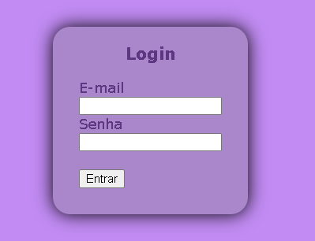
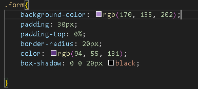
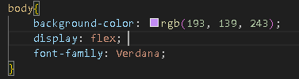
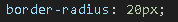

# projeto-login
Projeto avaliativo da disciplina de Fundamentos de Desenvolvimentos ministrada pelo professor Leonardo Rocha

## Índice
* [Descrição](#descrição)
* [Tecnologias](#tecnologias)
* [Referência](#referências)
* [Autor(a)](#autora)

## Descrição

Esse novo projeto é uma construção de uma pagina de login, para você poder entrar em aalgum aplicativo

# Resultado do projeto

## Elementos ultilizados

* body- Contém o corpo de um documento HTML, que é exibido pelo navegador em sua janela, ou seja, todo o conteúdo visível do site. É necessário que o <body> tenha ao menos um elemento "filho", ou seja, uma ou mais tags HTML dentro dele.

* form- é usada para criar um formulário em uma página da web.
* container- para criar uma área centralizada na página, limitando o conteúdo e facilitando a sua visualização. 
* padding- efine uma a distância entre o conteúdo de um elemento e suas bordas.
* height-  a sua função se descreve para garantir que possamos usar 100% da altura da nossa tela.
* background-color - define a cor de fundo de um elemento.
* display - define o comportamento do elemento em relação aos demais elementos do documento.
* font-family -  permite que se faça uma lista de prioridades de familias de fontes e/ou nomes genéricos de famílias a serem especificados para um elemento selecionado.
* justify-content-  é usada para alinhar os elementos ao longo do eixo principal.
* aling-items - controla o alinhamento de todos os itens no eixo transversal. 
* width-  é usada frequentemente em programação para se referir à largura de algo, como uma imagem, uma janela ou um elemento visual em uma página da web.
* padding-top - define as dimensões do espaçamento interno superior (distância do elemento para sua própria borda).
* borber-radius -destina-se a definir bordas arredondadas. 
* box-shadow - é utilizado para adicionar efeitos de sombra em volta de um elemento.
* text-aling - é utilizado para alinhar o texto dentro de um elemento.

## Estilização

* colocamos cor diferentes para dar um efeito melhor, o fundo coloquei uma cor mais forte e na frente uma cor clarinha e ao redor coloquei preto para destacar e ficar com um efeito diferente.

* colocamos diversos tamanhos para diferenciar cada um e entenderem melhor, entao destacamos bem o "login" para saber que precisam entrar com apenas o login.

* o formato também foi diferente para dar um efeito melhor e não ser comum, esse formato nao é um quadrado e nem uma bola, são uma mistura dos dois então por isso destaca bem por não ser tão comum igual os outros.

## Referências

[Alura](https://cursos.alura.com.br/forum/topico-height-no-html-311236)

[Mnd Web docs](https://developer.mozilla.org/pt-BR/docs/Web/CSS/padding)